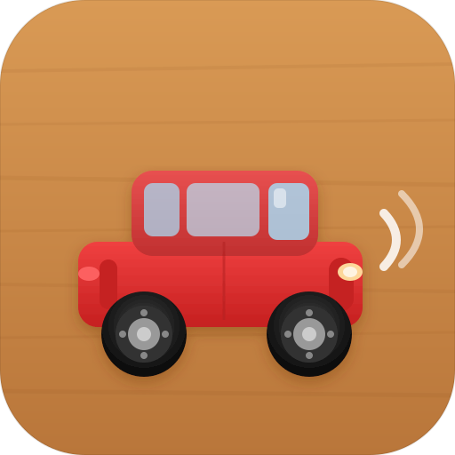

<p align="center">
  
</p>

<h1 align="center">Tutu</h1>

<p align="center">
  An offline 3D car-sliding puzzle for kids — slide the toy cars to free the red one. 🚗💨
</p>

<p align="center">
  <a href="https://endika.github.io/tutu/"><b>▶&nbsp; Play Tutu</b></a>
</p>

---

## How to play

Drag the toy cars along their lanes — they only slide forwards and backwards. Clear the
path and get the **red car** out through the exit on the right. Solve it and the next level
loads, a little harder every time.

- 💡 **Hint** — bounces the car you should move and marks where to slide it
- ↩️ **Undo** / 🔄 **Reset** — take a move back, or restart the level
- 🎵 **Music** & 🔊 **Sound** — toggle each one independently
- 🌐 **6 languages** — English, Español, Euskara, Galego, Valencià, Català

## Features

- **Endless, rising difficulty** — a hand-built level bank plus on-device generation for the long tail
- **Fully offline & installable** — a PWA that keeps working with no connection after the first load
- **No accounts, no backend, no ads** — your progress lives in your browser

## Tech

Vanilla TypeScript + [Vite](https://vite.dev), [Three.js](https://threejs.org) for the 3D board,
Tailwind for the HUD, and a Web Worker for level generation. Tested with Vitest.

```bash
npm install
npm run dev         # local dev server
npm run build       # production build to dist/
npm run test:run    # run the test suite
npm run gen:levels  # regenerate the level bank
```

Deployed to GitHub Pages on every push to `main`.
